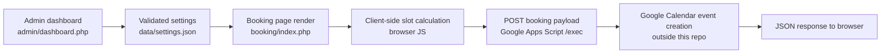

# Architecture Overview

## Summary

This repository is a mostly static website export with a small custom PHP layer for:

- rendering the booking page from JSON settings
- providing an admin dashboard to manage services and weekly availability
- persisting booking configuration to `data/settings.json`

The booking submission itself does **not** go through PHP. The browser posts directly to a Google Apps Script web app, which is expected to create the calendar event and return JSON.

That direct browser-to-Google-script handoff is the weakest part of the current architecture and is the most likely reason the booking system is not working correctly.

## Repository Structure

- `index.html`
  Public homepage generated by the site builder.
- `pricing/index.html`
  Public pricing page.
- `new-page/index.html`
  Public gallery page.
- `booking/index.php`
  Dynamic booking page. Loads settings from JSON, renders the form, calculates time slots in JavaScript, and submits bookings to Google Apps Script.
- `admin/login.php`
  Admin login page.
- `admin/dashboard.php`
  Admin dashboard for services and weekly availability.
- `includes/load-settings.php`
  Loads and validates `data/settings.json`, with fallback to backup/defaults.
- `includes/save-settings.php`
  Persists validated settings back to disk.
- `includes/settings-schema.php`
  Default settings plus normalization and validation helpers.
- `includes/auth.php`
  Session/auth helpers for the admin area.
- `data/settings.json`
  Live source of truth for services, add-ons, weekly hours, and blocked dates.
- `api.php`
  Separate form/webhook/mail backend used by the builder runtime. It is not part of the custom booking flow.
- `js/custom.260314202111.js`
  Original site JS. Contains an older booking implementation, but `booking/index.php` disables it with `window.PASTO_DYNAMIC_BOOKING = true`.

## Runtime Architecture

### 1. Public site shell

The homepage and most content pages are static HTML exports that load shared builder assets from `webcard/static/*`.

### 2. Settings and admin layer

The custom PHP layer uses `data/settings.json` as the booking configuration store.

Flow:

1. Admin updates services or weekly hours in `admin/dashboard.php`.
2. PHP validates input through `includes/settings-schema.php`.
3. `includes/save-settings.php` writes the normalized result to `data/settings.json`.
4. `booking/index.php` reads the same JSON via `includes/load-settings.php`.

### 3. Booking page rendering

`booking/index.php`:

- loads active services and add-ons from settings
- embeds them into the page as `pastoBookingData`
- calculates available slots client-side from:
  - selected service duration
  - selected add-on durations
  - weekly hours
  - blocked dates

Important detail: available slots are computed entirely in the browser from static settings. The page does **not** read Google Calendar availability before offering a time.

### 4. Booking submission

When the user submits the form, `booking/index.php` JavaScript:

1. collects form values
2. computes `start` and `end`
3. sends this payload to the Google Apps Script `exec` URL with `fetch()`
4. expects a JSON response shaped like:

```json
{
  "success": true,
  "message": "..."
}
```

Payload shape sent by the page:

```json
{
  "name": "Customer Name",
  "email": "customer@example.com",
  "phone": "1234567890",
  "service": "Classic Taper",
  "addons": ["Hot Towel"],
  "notes": "Optional notes",
  "start": "2026-03-24T18:00:00.000Z",
  "end": "2026-03-24T18:55:00.000Z"
}
```

## Booking System Data Flow



## Why Google Calendar Integration Is Likely Failing

## 1. No server-side relay

The browser posts directly to Google Apps Script:

- `booking/index.php`
- `js/custom.260314202111.js`

Because there is no PHP proxy in this repo for bookings, the integration depends on the Apps Script web app accepting cross-origin browser requests exactly as sent.

If the script deployment, permissions, CORS behavior, or response format changed, the booking page fails immediately.

## 2. Response contract is strict and fragile

The booking page always does:

```js
var result = await res.json();
```

So the script must return valid JSON every time, even on errors.

If the Apps Script returns:

- plain text
- HTML error output
- a redirect page
- an auth/permission page
- an empty body

then the page falls into the generic `"Something went wrong. Please try again."` path.

## 3. Missing explicit `Content-Type: application/json`

The booking request sends `JSON.stringify(payload)` but does not send an explicit JSON content type header.

Current behavior:

```js
fetch(GAS_ENDPOINT, {
    method: 'POST',
    body: JSON.stringify(payload)
});
```

If the Apps Script expects `e.postData.type === "application/json"` or parses only JSON requests with that header, it may treat the request incorrectly or fail to parse it.

## 4. Timezone conversion mismatch is very likely

The page creates local browser dates and then sends:

```js
start.toISOString()
end.toISOString()
```

`toISOString()` converts the local chosen time into UTC.

Example:

- customer chooses `2026-03-24 14:00` local time
- browser sends something like `2026-03-24T18:00:00.000Z` depending on timezone

If the Google Apps Script assumes these are local timestamps instead of UTC, events will be created at the wrong time.

This is one of the most likely "not communicating correctly" symptoms even when the POST itself succeeds.

## 5. No read-back from Google Calendar into availability

The booking page calculates open slots only from `data/settings.json`.

It does **not**:

- query Google Calendar for existing events
- remove already-booked times from the dropdown
- reserve a slot before final submission

That means the page and Google Calendar are not actually synchronized systems. The page only knows business hours, while Google Calendar holds real bookings.

So even if the Apps Script works, the current design still allows stale or conflicting slot selection.

## 6. Older booking script still exists

`js/custom.260314202111.js` contains an older booking implementation and the same Apps Script endpoint.

`booking/index.php` sets:

```js
window.PASTO_DYNAMIC_BOOKING = true;
```

and the old script checks that flag and returns early, which is good. But this is still a maintenance risk because there are two booking implementations in the repo and both target the same external script.

## Current Source of Truth

Today the system has split ownership:

- `data/settings.json` is the source of truth for services, add-ons, weekly hours, and blocked dates
- Google Calendar is the source of truth for real appointments
- the booking page only reads the first source and writes to the second source indirectly

This split is the core architecture problem.

## Recommended Direction

## Minimum stabilization

Keep the current architecture, but make the contract explicit:

1. Define the exact request payload expected by Apps Script.
2. Define the exact JSON response format for success and failure.
3. Add explicit request headers from the booking page.
4. Return structured errors from Apps Script.
5. Log the raw Apps Script response while debugging.
6. Standardize timezone handling end to end.

## Better architecture

Move booking submission behind your own PHP endpoint inside this repo.

Suggested flow:

1. Browser submits to a local PHP endpoint.
2. PHP validates payload and normalizes times.
3. PHP calls Google Apps Script or Google Calendar API server-side.
4. PHP returns stable JSON to the browser.
5. Optionally PHP can also check real calendar conflicts before confirming the booking.

Benefits:

- easier debugging
- better validation
- no browser-side CORS dependency
- safer handling of secrets and integrations
- one stable contract between frontend and backend

## Most Relevant Files For This Issue

- `booking/index.php`
  Main booking UI, client-side slot logic, and direct submission to Google Apps Script.
- `data/settings.json`
  Booking configuration used to calculate displayed availability.
- `admin/dashboard.php`
  Admin tooling that edits weekly hours and services.
- `includes/load-settings.php`
  Settings loader for the booking page.
- `includes/settings-schema.php`
  Validation and defaults for booking settings.
- `js/custom.260314202111.js`
  Older booking implementation retained in the repo.

## Bottom Line

The booking page and Google Calendar are not fully integrated as a two-way system.

Right now the site:

- reads availability from local JSON
- writes bookings directly from the browser to Google Apps Script
- assumes the script accepts raw JSON and returns JSON
- assumes UTC timestamps are interpreted correctly

So the likely failure is not just "communication" in a generic sense. The architecture currently has:

- a fragile browser-to-script boundary
- no guaranteed shared request/response contract
- probable timezone ambiguity
- no synchronization between displayed slots and real calendar occupancy

That is the architectural reason the integration feels unreliable.
